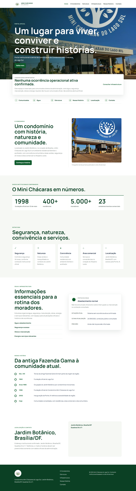
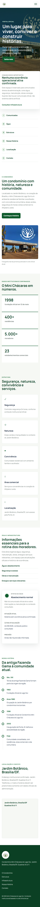

# 🏢 Portal do Condomínio Mini Chácaras do Lago Sul

> Portal institucional e central de comunicação do Condomínio Mini Chácaras do Lago Sul, localizado no Jardim Botânico, Brasília/DF.

 **[Acessar o portal online](https://denilsonmiranda2001.github.io/site_mini_chacaras/)**
 Sobre o projeto

O Portal do Condomínio Mini Chácaras do Lago Sul foi desenvolvido com o objetivo de criar um canal institucional moderno, acessível e responsivo para centralizar informações importantes do condomínio e facilitar a comunicação com os moradores.

O projeto apresenta informações institucionais, comunicados, infraestrutura, localização, história do condomínio e orientações de interesse dos moradores.

A proposta é oferecer uma experiência simples e clara, permitindo que as principais informações sejam encontradas rapidamente tanto em computadores quanto em dispositivos móveis.

Funcionalidades

Portal institucional
- Apresentação do condomínio
- Informações institucionais
- Dados gerais do condomínio
- Estrutura e características da comunidade
- História do condomínio

Comunicação com moradores
- Área de comunicados importantes
- Destaque para informações relacionadas ao abastecimento de água
- Orientações aos moradores
- Atualização das informações publicadas
  
Coleta seletiva
- Informações sobre coleta de lixo orgânico
- Dias e horários da coleta
- Orientações para colaboração dos moradores
- Incentivo à manutenção das áreas de convivência

 Localização
- Informações sobre a localização do condomínio
- Mapa integrado através do OpenStreetMap

Responsividade
O portal foi desenvolvido para proporcionar uma experiência adequada em diferentes tamanhos de tela:

- 💻 Desktop
- 📱 Smartphones
- 📲 Tablets

Foram realizados testes e ajustes específicos para diferentes resoluções.

 Tecnologias utilizadas

Front-end

- **HTML5**
- **CSS3**
- **JavaScript**

Recursos externos

- **Google Fonts**
- **OpenStreetMap**

Hospedagem

- **GitHub Pages**

 Interface
O projeto utiliza uma abordagem visual limpa e institucional, priorizando:

- Clareza das informações
- Hierarquia visual
- Facilidade de navegação
- Responsividade
- Acessibilidade
- Identidade visual do condomínio

A interface foi construída considerando a necessidade de apresentar informações importantes de forma rápida e objetiva.

Screenshots

#Desktop



### 📱 Mobile




Acessibilidade
O projeto utiliza alguns recursos voltados à melhoria da acessibilidade e experiência de navegação, incluindo:

- Estrutura semântica em HTML
- Textos alternativos em imagens
- Navegação principal estruturada
- `aria-label` em elementos interativos quando necessário
- Link para pular diretamente ao conteúdo principal
- Layout responsivo

SEO

O portal possui configurações básicas de SEO e compartilhamento, incluindo:

- `title` personalizado
- Meta description
- Open Graph
- Idioma `pt-BR`
- Favicon
- Dados estruturados utilizando `Schema.org`
- `robots.txt`

Estrutura do projeto

```text
site_mini_chacaras/
│
├── assets/
│   ├── imagens e recursos visuais
│   └── ...
│
├── admin.html
├── admin.js
├── index.html
├── styles.css
├── robots.txt
├── screenshots-final-1440.png
├── screenshots-final-320.png
├── screenshots-final-390.png
└── README.md
